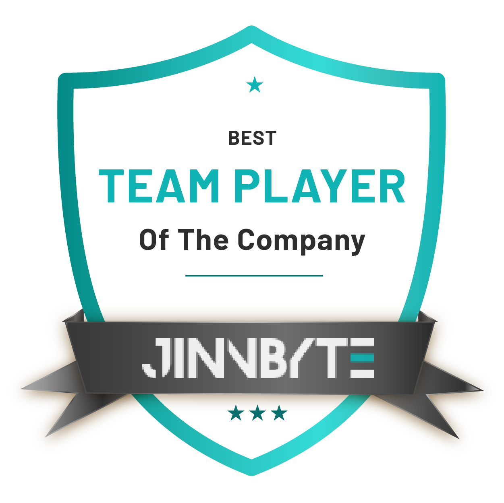

# Hi, I'm Noman Ali :wave:

The world can be an overwhelming place, so I help making people’s life easier by developing websites and applications as a software developer.

Let me tell you a bit about myself 
- :desktop_computer: I have been working for JinnByte Private Limited as a Backend Developer
- :printer: I have worked in .Net and js and databases which include MS SQL
- :technologist: Besides having great skills, I believe learning must never end! I have learnt many new skills such as Team Work, Management, and Relation Building
- :tennis: In my free time, I am a gaming geek, I love to play Call of Duty Multiplayer and Story Mode Games
- :mountain: Love exploring off-beat hikes and peaks in the Northern Pakistan. My absolute favorite: <a href="https://goo.gl/maps/zV3r6AYPzJPiWTPC9">Siri Paye Meadows</a>
- :smile: Pronouns: He/him
<h3>:computer: GitHub Profile Stats</h3>

  

    
  

  

    
  

<b>Note:</b> Top languages is only a metric of the languages my public code consists of and doesn't reflect experience or skill level.
<b>Comit History:</b>

